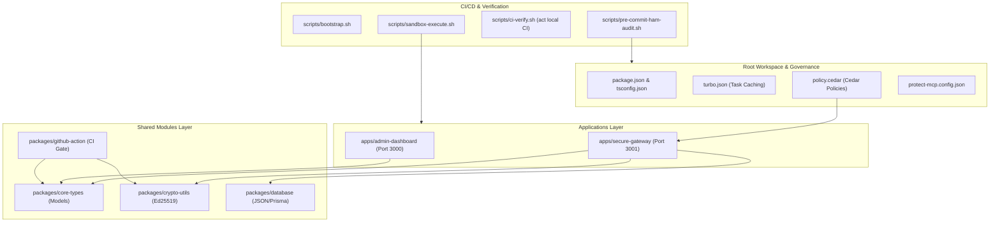

# ⚖️ FidusGate

### Reference Implementation for Zero-Trust Governance & Runtime Verification for AI Agents

FidusGate is an **open-source reference implementation and capability showcase** for zero-trust repository governance and runtime verification for **Autonomous AI-Agent Operations**. It shifts security left—enforcing programmatic access controls, signature verification (Ed25519), and simulated seccomp auditing directly on active agentic workflows.

Designed with an extensible, **risk-centric architecture**, FidusGate establishes explicit, policy-enforced boundaries around AI tool execution, serving as a reference for securing agent execution to prevent unauthorized system modifications, privilege escalation, and prompt-injection-driven compromise.

> [!IMPORTANT]
> FidusGate is a reference implementation, not a production-hardened product.

---

## 🛠️ Status, Maturity & Mocks

FidusGate is designed as a capability showcase and educational reference. It combines real security mechanisms with simulated components for demonstration purposes:

*   **Real Security Controls:**
    *   **Cedar Access Policy Engine:** Active, file-level policy gating parsing permissions written in the [policy.cedar](./policy.cedar) policy file.
    *   **Cryptographic Receipts:** Signed transaction receipts verified on the client dashboard using real Ed25519 public-key cryptography. (Note: While the Ed25519 receipt signing itself is real, because keys are stored in the local datastore for demo purposes, the non-repudiation property is illustrative, not enforceable in this configuration.)
    *   **Filesystem Drift Detection:** Live tracking of untracked/modified files using Git plumbing commands, with rollback options.
*   **Simulated Components & Mocks:**
    *   **Database Persistence:** Defaults to a local flat-file JSON datastore for ease of local setup. Pluggable PostgreSQL integration via Prisma is provided but must be configured for real use.
    *   **Syscall Audit Monitoring:** Models system call events based on command script strings rather than attaching actual eBPF kernel probes.
    *   **Consensus Key Aggregation:** Simulates multi-signature key aggregation (MuSig2) via a multi-party attestation workflow stored in the database.
    *   **Identity Provider:** Simulates OpenID Connect (OIDC) JWT token issuance via a federated dashboard widget.
    *   **Integrations (SPIFFE/OIDC/KMS):** Stubbed placeholder fields in exported audit logs demonstrate planned integration designs rather than production hooks.

---

## 🛡️ Threat Model

### In-Scope Security Objectives
FidusGate aims to defend against:
1.  **Prompt Injection Privilege Escalation:** An attacker injecting malicious instructions (e.g. `rm -rf /`) into an agent's context, causing the agent to execute unauthorized commands.
2.  **Unauthorized Configuration Modifications:** Restricting the agent's ability to modify system policies (`policy.cedar`) or critical scripts (`scripts/*`) even if the agent is executing files in the repository.
3.  **Supply Chain Attacks / Package Pollution:** Gateway-level blocking of commands that dynamically download or install arbitrary packages (e.g. `curl`, `npm install`) on the host system.
4.  **Audit Trail Tampering:** Establishing a signed, tamper-evident append-only receipt log using Ed25519 public-key signatures, making retro-active history modification visible (illustrative in this demo environment due to local key storage; see Status, Maturity & Mocks).

### Out-of-Scope (What we are NOT defending against)
1.  **Host-Level Kernel Compromise:** The sandbox environment relies on standard Docker container namespaces. It does not prevent low-level host exploits unless configured with an active gVisor runtime.
2.  **Compromised Administrator Credentials:** Administrators have ultimate bypass authorities (e.g. policy updates or command override keys). FidusGate does not defend against compromised admin credentials.
3.  **Adversarial Network Traffic:** FidusGate filters tool-call arguments at the application boundary; it is not a network-level firewall.

---

## 🚫 Known Limitations

1.  **Syscall Auditing Simulation:** System call auditing parses command strings at the application gateway instead of hooking into active host-level kernel probes (such as eBPF or native `seccomp`).
2.  **Single-Host Sandbox:** Sandbox isolation runs containerized on the local host machine, sharing the underlying OS kernel.
3.  **Key Management:** Cryptographic key pairs for multi-role consensus are stored inside the database layer for demonstration purposes rather than being securely stored inside a Hardware Security Module (HSM) or cloud Key Management Service (KMS).

---

## 🔍 How to Review This

To verify the governance model and containment controls:
1.  **Cedar Policy Model:** Review the [policy.cedar](./policy.cedar) file to evaluate the risk-tiered permission rules.
2.  **Sandbox Boundaries:** Inspect [scripts/sandbox-execute.sh](./scripts/sandbox-execute.sh) to evaluate how copy-on-write Docker runtime mounts isolate tool executions.
3.  **Audit Log Verification:** Review the signature validation loop inside [packages/crypto-utils/src/index.ts](./packages/crypto-utils/src/index.ts) to verify the tamper-evident receipt verification.

---


## 🏛️ Regulatory & Risk Control Alignment

FidusGate maps conceptually to control families in **NIST SP 800-53, ISO/IEC 27001, and SOC 2 Common Criteria**, demonstrating how corporate compliance structures can be translated into programmatic policy rules. Note that this is an illustrative, conceptual mapping, and FidusGate itself does not deliver an audited compliance posture or certification.

*   **Separation of Duties (SoD):** Programmatically separates code compilation, infrastructure modification, and security policy modifications. AI agents are locked out of modifying policy boundaries (`policy.cedar`) or core scripts (`scripts/*`) directly.
*   **Auditability & Non-Repudiation:** Generates cryptographically signed **Ed25519 receipts** for all gateway transactions, establishing a tamper-evident, append-only audit log of agent actions (illustrative for non-repudiation in this demo due to local key storage).
*   **Access Control & Least Privilege:** Restricts tool invocation in real-time based on risk severity, forcing high-risk terminal commands into isolated Docker sandboxes.
*   **System Integrity Protection:** Automatically audits agentic pipelines to scan for dynamic prompt injection vectors and insecure runtime variables.

---

## 📖 Documentation & Playbooks Portal

FidusGate includes documentation and playbooks to assist security officers and developers in managing agentic boundaries.

* **[Documentation Portal](./docs/README.md):** The primary index mapping all guides and governance skills.
* **[Monorepo Architecture Guide](./docs/ARCHITECTURE.md):** Deep dive into high-level topologies, component details, and Docker sandbox configurations.
* **[Local CI/CD Emulation Manual](./docs/local-ci-emulation.md):** Offline pipeline execution using `act` and prompt injection verification checks.
* **[Phase 3 Verification Walkthrough](./docs/walkthrough.md):** Concrete operational runbooks for filesystem drift auto-reconciliation, Gemini Cedar Co-Pilots, and conventional commit tags.

---

## 📐 Unified Monorepo Architecture

The workspace is structured as a modular **npm Workspaces** monorepo, promoting strict dependency scoping and isolated boundaries:



### Component Details
1.  **`packages/core-types`**: Declares strictly typed boundaries for transactions, security findings, logs, and verifiable receipts.
2.  **`packages/crypto-utils`**: Encapsulates cryptographic signing and verification routines powered by **Ed25519** public-key cryptography.
3.  **`packages/database`**: A demonstration database module utilizing a seeded local JSON store for offline capability verification, with pluggable support for standard SQL databases (e.g. PostgreSQL via Prisma). Production deployments require a real database configuration.
4.  **`packages/github-action`**: A custom GitHub Action guard that validates workflows, scans for prompt injections, and verifies commit receipts.
5.  **`apps/secure-gateway`**: Express microservice exposing transaction APIs with automatic PII (Personally Identifiable Information) masking and signature signing, designed to interface with database persistence layers.
6.  **`apps/admin-dashboard`**: A React operations dashboard with a receipt verifier, live logs, and command console.

---

## 🔒 The Risk-Tiered Governance Framework

FidusGate establishes a four-tier risk classification for tools available to autonomous agents. These categories map directly to Cedar access-control policies parsed at the gateway:

| Risk Tier | Scope of Actions | Cedar Permission Rule | Enforcement Strategy |
| :--- | :--- | :--- | :--- |
| **Tier 1 (Low)** | File reads, directory listing, regex searches | `permit` tool call globally | **Auto-Approved:** Read-only tasks run without blockages to prevent developer friction. |
| **Tier 2 (Medium)** | Source directory file modifications (`apps/*`, `packages/*`) | `permit` for source directories | **Shadow-Enforced:** Permitted in source paths, but forbidden from editing configuration files (`policy.cedar`, `protect-mcp.config.json`). |
| **Tier 3 (High)** | Terminal scripting, execution of compilation tasks | `permit` strictly within sandbox wrappers | **Sandboxed Execution:** Requires script-spawning to happen inside secure, isolated sandboxes (`sandbox-execute.sh`). Raw host access is blocked. |
| **Tier 4 (Critical)** | Global networking, arbitrary package installations (`npm i`, `curl`) | `forbid` globally | **Strict Interdiction:** Blocked at the gateway level to prevent supply chain attacks and untrusted package pollution. |

---

## 🔍 CI/CD Static Security Audit Showcase

To demonstrate the robustness of our scanning controls, we modeled three distinct prompt-injection vector exposures. These are deliberately staged in an isolated demo workflow (`.github/workflows/ci-agent-pipeline.yml`) to show detection, and the live workflows ship hardened.

1.  **Vector A (Env Var Intermediary):** Unauthenticated variables in AI prompts that allow an external contributor to hijack the review agent.
2.  **Vector D (PR Target + Checkout):** Unprivileged checking out of head commits inside a privileged workflow container.
3.  **Vector H (Dangerous Sandbox Configurations):** AI agent config profiles granting administrative capabilities (`danger-full-access`).

### Remediated Controls Staged
All workflows have been hardened by default:
*   Transitioned triggers from `pull_request_target` to unprivileged `pull_request` triggers.
*   Enforced read-only content scopes (`contents: read`).
*   Stripped dynamically interpolated environment strings from AI prompts.
*   Hardened agent runtime settings to use a strict `"sandbox": "workspace-read"` context with zero execution capabilities.

---

## ⚙️ Core Reference & Verification Features

FidusGate includes a suite of security policy simulation and observability tools integrated into the developer and administration dashboard:

### 🧬 1. Live + Draft Cedar Policy Simulator
* **Interactive dry-runs:** Allows developers to toggle the simulator to `"Enable Custom Draft Policy Overlay (In-Memory Dry Run)"` and edit Cedar policies in an in-memory editor on the dashboard.
* **Diagnostics:** Instantly evaluates simulated agent tool-calls (e.g. `sb:issuer:agent-80` calling `write_file`) against your active or draft policy.
* **Evaluation logs:** Returns policy evaluation results (`ALLOW` or `DENY`) along with the specific matching rules evaluated by the Cedar engine.
* **Scope isolation:** Draft changes are kept in-memory for testing, ensuring active local policies are not overwritten until explicitly committed.

### 💼 2. Forensic JSON Compliance Package Exporter
* **Tamper-evident logs:** The Forensic Command Timeline tracks audited commands executed inside the sandboxed execution environment.
* **Unified package format:** Allows exporting a signed compliance receipt compiling sandbox logs, simulated SPIFFE identifiers, OIDC attestation claims, and Ed25519 signatures into a structured JSON envelope.
* **Access controls:** Access to forensic compliance reports is restricted to `admin` or `auditor` roles to prevent credential harvesting.

### 🤖 3. AI-Agent Auto-Remediation Suggestions & Suggested Autofixes
* **Corrective guidance:** When the Command Auditor intercepts a blocked command (e.g. an agent trying to run `curl http://...`), the gateway returns a remediation recommendation (e.g. *suggesting configured mirrors or cached local files*).
* **Suggested Autofixes:** The gateway returns a structured `suggestedAutofix` object containing the `target` forbidden command and its safe `replacement` command (e.g., automatically rewriting dynamic `pip install` commands to run safely inside the sandbox container).
* **One-Click Console Banner:** FidusGate's Sandbox Console UI automatically displays a collapsible auto-fix banner if a command execution fails with a suggested autofix, featuring an interactive **"Apply Fix"** button to execute the replacement command with a single click.

### 📐 4. Collapsible Server Architecture Guide
* **Dashboard Integration:** An interactive guide integrated as a collapsible accordion section right before the terminal console.
* **Interactions:** A header toggle expands or collapses the guide body and updates a status chevron.
* **Component Profiling:** Displays component details (Secure Gateway, Operations Console, Cryptographic Utilities, Database Clients, Core Types, and Sandbox execution layers), defining their purpose, runbook parameters, and key functions.

### 📡 5. Filesystem Drift Detection & Auto-Reconciliation
* **Drift Tracking:** The Secure Gateway utilizes `scripts/sandbox-drift-detect.sh` to track untracked, modified, or deleted files inside the workspace relative to git index status (excluding environment, node_modules, and cache files).
* **Stateful Logging & WebSockets:** Logs all drift files, change types (`added`, `modified`, `deleted`), and raw diffs to the datastore, broadcasting updates via WebSockets (`filesystem_drift_detected`) to update the Operations Console UI.
* **One-Click Reconcile Rollbacks:** Allows administrators to trigger `POST /api/sandbox/reconcile` from the dashboard, executing a restore sequence (`git restore . && git clean -fd`) inside the workspace to revert the environment to a clean git status, update database records, and refresh UI clients.

### 🧠 6. Gemini-Powered Cedar Co-Pilot
* **Natural Language to Policy Translation:** Provides conversational policy generation inside the `/api/policy/co-pilot` endpoint. Developers can submit conversational prompts (e.g. *"allow pm-sme to write .md files"*).
* **Google Gemini API Integration:** Leverages the Google Gemini API (with configurable model settings, defaulting to `gemini-1.5-pro` as an example) to translate user intent into syntactically valid Cedar authorization rules and a plain-text description.
* **Rule-Based Mock Fallback Engine:** Implements a rule-based mock parser that handles key policies (for roles like `pm-sme` and `security-sme`) when `GEMINI_API_KEY` is not set, providing robust fail-safes during offline development.

### 🔑 7. Multi-Role Consensus Attestation & Execution Bypass (Phase 4)
* **Attestation Gating:** Suspends terminal execution of high-risk shell commands until approved by consensus. Attestations are simulated using multi-role keys (Admin, Developer, Auditor) stored in the database.
* **Initiator Self-Attestation Block:** Programmatically prevents the proposer of a command from signing off on their own action (satisfying Separation of Duties).
* **Consensus Bypass Execution:** Bypasses standard allowlist blocks inside `/api/sandbox/execute` once the approved cryptographic consensus is met. Running the command in the Sandbox Console executes the task in the isolated container and marks the action status as `completed`.
* **Auditor Role & OIDC Widget Support:** Extends the federated authentication widget with specialized OIDC mock identity routing, aligning default emails based on the selected role button to simplify local review.

### 📡 8. Simulated Seccomp Auditing & Syscall Flow Modeling (Phase 5)
* **Simulated Seccomp Auditing:** Models and traces expected system call flows (`sys_execve`, `sys_openat`, `sys_read`, `sys_unlinkat`, `sys_fchmodat`) on the Secure Gateway based on parsed command strings.
* **Violation Lockouts:** Triggers a simulated 15-minute execution lockout whenever critical system calls are modeled (e.g. `sys_ptrace` for debugging probes, `sys_setns`/`sys_unshare` for namespace modifications, or unauthorized outbound socket calls).
* **Frontend React Integration:** Wires the modeled `syscalls` array returned by sandbox execution REST calls into a dynamic React state hook. The syscall monitor panel renders simulated ALLOWED and BLOCKED logs with visual indicators and violation reasons.

### ⚡ 9. Adaptive Auto-Throttling & macOS Sandbox Compatibility (Phase 5)
* **Intelligent Auto-Throttling:** Implemented a moving-average latency tracker that triggers defensive rate-limiting (HTTP 429) when average sandbox execution times spike. Configured with a `2000ms` window to prevent standard Docker container startup overheads from causing throttle locks.
* **macOS `timeout` Fallback Wrapper:** Built a dynamic bash helper inside `sandbox-execute.sh` that detects if the standard `timeout` utility is missing (common on default macOS). It gracefully routes to `gtimeout` (if installed via coreutils) or direct execution, resolving Docker execution environment lockups.
* **Unified State Reset:** Configured the database `/api/reset` handler to atomically clear the moving latency average alongside compliance states, instantly unlocking active throttling parameters.

---

## ⚙️ Quick Start & Execution Guide

### Prerequisites
*   **Node.js** >= 20.0.0
*   **Docker** (Optional, for full sandbox isolation)

### 🚀 1. Bootstrapping the Repository
Run the unified repository bootstrapper. This script configures local git hooks, audits runtime toolchains, and verifies directory-scoped memory consistency:
```bash
npm run bootstrap
```

### 💻 2. Running the Applications
To run both the secure gateway backend and the administration dashboard in parallel:
```bash
npm run dev
```
*   **Admin Dashboard:** [http://localhost:3000](http://localhost:3000)
*   **Secure Gateway:** [http://localhost:3001](http://localhost:3001)

### 🛡️ 3. Simulating a Sandboxed Security Audit
You can execute a secure static audit of your workflows or local compilation within the unprivileged Docker container:
```bash
npm run sandbox
```

### 🧪 4. Local CI/CD Emulation
To run your hardened workflows entirely offline inside a Docker container using `act`:
```bash
npm run ci
```

### 🚨 5. Cryptographic Receipt Verification
You can copy any cryptographically signed transaction receipt from the dashboard log grid, paste it into the **Receipt Verifier Tool** inside the admin portal, or verify it offline using:
```bash
node packages/crypto-utils/dist/index.js --verify <path_to_receipt_json>
```

### 📡 6. Filesystem Drift Detection & Auto-Reconciliation
To manually audit filesystem drift in a sandbox or workspace:
```bash
bash scripts/sandbox-drift-detect.sh <workspace_path>
```
To trigger the active rollback and reconcile all untracked or modified changes:
```bash
curl -X POST http://localhost:3001/api/sandbox/reconcile -H "Authorization: Bearer <admin_token>"
```

### 🧠 7. Gemini Cedar Policy Co-Pilot
To generate a Cedar policy from a natural language request using the Co-Pilot API:
```bash
curl -X POST http://localhost:3001/api/policy/co-pilot \
  -H "Content-Type: application/json" \
  -H "Authorization: Bearer <developer_token>" \
  -d '{"prompt": "allow pm-sme to write md files"}'
```

---

## 📦 Continuous Delivery & Automated Releases

FidusGate implements a highly standardized, trunk-based delivery model governed by conventional commits and automated release pipelines:

* **Conventional Commit Compliance:** Code changes are prefixed using semantic scopes (e.g. `feat(secops)`, `chore(release)`, `fix(crypto)`). This enables deterministic dependency mapping and machine-readable changelog logs.
* **Semantic Release Automation (`.releaserc.json`):** Leverages automated release steps during the main branch pipeline build to:
  1. Parse commit messages and automatically calculate the next semantic version (Major/Minor/Patch).
  2. Auto-generate comprehensive changelogs based on standard templates.
  3. Publish release tags and drafts directly to GitHub.
* **Release Pipeline Workflow (`.github/workflows/release.yml`):** Runs on push to the `main` branch, performing automated test validation (`npm run test`), monorepo type-checking (`tsc`), and launching the release runner securely.

---

## 🔬 Enterprise Production & Hardening Guide

While FidusGate is designed to scaffold zero-trust structures with local configurations for development, transitioning to a highly available enterprise-grade production environment requires upgrading the following layers:

### 1. Database Architecture & Persistence Strategy
* **Current Setup**: By default, `@fidusgate/database` operates in a zero-dependency local JSON file store mode. However, a fully relational database capability is already integrated using the **Prisma ORM**.
* **Transition to Production**:
  1. Define a `DATABASE_URL` pointing to your PostgreSQL cluster in the `.env` file of the gateway.
  2. Run `npx prisma db push` to generate and apply the structured database schema.
  3. Deploy PostgreSQL with a highly available, clustered setup (e.g., using multi-AZ deployments, Aurora PostgreSQL, or PgBouncer for connection pooling to survive traffic spikes).
  4. Implement regular database backup routines and read-replicas for audit trail analytics.

### 2. Audit Log Security & Append-Only Guarantees
* **Current Setup**: Storing transaction receipts under `.memory/receipts` and logs in `.memory/audit-log.md` is convenient for local inspection, but flat files lack tamper-evident guarantees, retention compliance, or lock concurrency.
* **Transition to Production**:
  1. **SIEM / Centralized Logging**: Configure the secure-gateway's security log streams to pipe directly to centralized, secure audit systems (e.g. AWS CloudWatch, Datadog, or Grafana Loki).
  2. **Centralized Ledger Database**: Integrate a dedicated ledger store like Amazon QLDB or a tamper-evident blockchain ledger to record cryptographic transaction hashes, ensuring absolute non-repudiation.
  3. **Hash-Chain Auditing**: Implement cryptographic chaining where each new receipt contains the signature of the previous receipt block, rendering any history deletions immediately visible to validators.
  4. **Retention Policies**: Configure log group resource policies to enforce strict write-once-read-many (WORM) parameters with standardized retention rules (e.g., 7 years for SOC 2 / ISO 27001 compliance).

### 3. Gateway Configuration Modes
The `protect-mcp.config.json` governs the gateway runtime enforcement behavior via the `"mode"` key:
* `"shadow"`: Evaluates all incoming transaction requests against Cedar access-control rules and logs the decisions, but does not block requests. This is useful for auditing and testing policies against real-world developer workflows before enforcement.
* `"enforce"`: Full zero-trust active gatekeeping. The secure-gateway actively blocks any tool execution, receipt submission, or console command that fails Ed25519 cryptographic validation or evaluates to `"deny"` under Cedar access controls.

---

## 🌿 An Evergreen Reference Implementation

FidusGate is designed as an evergreen, evolving reference implementation of runtime governance for AI agent security:

*   **Continuous Evolutionary Delivery:** Fully governed by conventional commits and automated pipelines, ensuring that the latest security signatures, Cedar rules, and policy maps compile, version, and tag autonomously.
*   **Real-World Reference Capabilities:** By shipping concrete templates—including sandboxed command execution, dynamic AST policy simulations, tamper-evident cryptographic logs, and simulated system call modeling—FidusGate establishes a living, functional benchmark. It moves the industry past theoretical policy PDFs into **explicitly policy-enforced and operationally auditable runtime enforcement**.
*   **Open-Source and Extensible Core:** The modular npm workspace monorepo is engineered for community expansion. Security architects can write new custom playbooks under the `skills/` tree, deploy specialized authentication mechanisms via our federated provider hooks, or plug in advanced LLM-based firewalls to evaluate adversarial prompt parameters.

---

## 🔬 Audit & Production Quality Status
* **Junk Files**: 100% Cleared. Build directories (`dist`, `.turbo`), cache files, and OS noise have been clean-pruned.
* **Secrets Check**: 100% Secure. Absolutely no passwords, raw private keys, or actual developer credentials are committed.
* **Lockfile Fidelity**: Standardized with an `npm` lockfile (`package-lock.json`).
* **Test Coverage**: Tested and verified with a built-in zero-dependency Node.js test runner covering Ed25519 cryptography, Cedar dynamic AST parser evaluation, and shell command allowlist audits.
