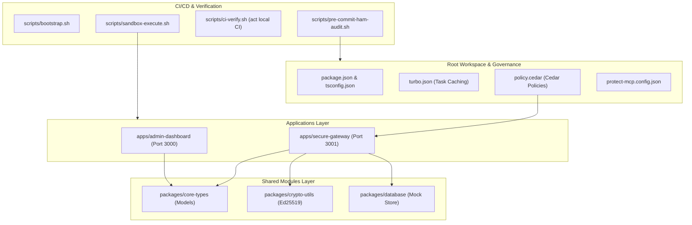

# ⚖️ VeritasAudit

### Cryptographically Verified, Self-Governing AI DevSecOps Governance Platform

VeritasAudit is an enterprise-grade, zero-trust repository governance and runtime verification framework specifically engineered for **Autonomous AI-Agent Operations**. It shifts security left, enforcing real-time programmatic access controls, deterministic signature verification, and automated static security analysis on agentic workflows.

Designed with a **risk-centric architecture**, VeritasAudit establishes mathematically verifiable boundaries around AI tool execution, preventing unauthorized environment modifications, privilege escalation, and prompt-injection-driven system compromise.

---

## 🏛️ Regulatory & Risk Control Alignment

VeritasAudit is modeled to align with international risk management and cybersecurity controls (e.g., **NIST SP 800-53, ISO/IEC 27001, SOC 2 Common Criteria**), translating corporate compliance structures into deterministic code policies:

*   **Separation of Duties (SoD):** Programmatically separates code compilation, infrastructure modification, and security policy modifications. AI agents are locked out of modifying policy boundaries (`policy.cedar`) or core scripts (`scripts/*`) directly.
*   **Auditability & Non-Repudiation:** Generates cryptographically signed **Ed25519 receipts** for all gateway transactions, establishing an immutable, verifiable ledger of agent actions.
*   **Access Control & Least Privilege:** Restricts tool invocation in real-time based on risk severity, forcing high-risk terminal commands into isolated Docker sandboxes.
*   **System Integrity Protection:** Automatically audits agentic pipelines to scan for dynamic prompt injection vectors and insecure runtime variables.

---

## 📐 Unified Monorepo Architecture

The workspace is structured as a modular **npm Workspaces** monorepo, promoting strict dependency scoping and isolated boundaries:



### Component Details
1.  **`packages/core-types`**: Declares strictly typed boundaries for transactions, security findings, logs, and verifiable receipts.
2.  **`packages/crypto-utils`**: Encapsulates cryptographic signing and verification routines powered by modern **Ed25519** public-key cryptography.
3.  **`packages/database`**: A mock thread-safe database backed by persistent, seeded JSON records for immediate offline display.
4.  **`apps/secure-gateway`**: High-security Express microservice exposing transaction APIs with automatic PII (Personally Identifiable Information) masking and signature signing.
5.  **`apps/admin-dashboard`**: A premium Vite-React operations control center styled with deep HSL space colors, glassmorphic card overlays, and Outfitted typography. Includes a standalone receipt signature verifier, live log streams, and interactive command consoles.

---

## 🔒 The Risk-Tiered Governance Framework

VeritasAudit establishes a four-tier risk classification for tools available to autonomous agents. These categories map directly to Cedar access-control policies parsed at the gateway:

| Risk Tier | Scope of Actions | Cedar Permission Rule | Enforcement Strategy |
| :--- | :--- | :--- | :--- |
| **Tier 1 (Low)** | File reads, directory listing, regex searches | `permit` tool call globally | **Auto-Approved:** Read-only tasks run without blockages to prevent developer friction. |
| **Tier 2 (Medium)** | Source directory file modifications (`apps/*`, `packages/*`) | `permit` for source directories | **Shadow-Enforced:** Permitted in source paths, but forbidden from editing configuration files (`policy.cedar`, `protect-mcp.config.json`). |
| **Tier 3 (High)** | Terminal scripting, execution of compilation tasks | `permit` strictly within sandbox wrappers | **Interactive MFA:** Requires script-spawning to happen inside secure, isolated sandboxes (`sandbox-execute.sh`). Raw host access is blocked. |
| **Tier 4 (Critical)** | Global networking, arbitrary package installations (`npm i`, `curl`) | `forbid` globally | **Strict Interdiction:** Blocked at the gateway level to prevent supply chain attacks and untrusted package pollution. |

---

## 🔍 CI/CD Static Security Audit Showcase

To demonstrate the robustness of our scanning controls, we modeled three distinct prompt-injection vector exposures in our local GitHub Actions pipeline (`.github/workflows/ci-agent-pipeline.yml`):

1.  **Vector A (Env Var Intermediary):** Unauthenticated variables in AI prompts that allow an external contributor to hijack the review agent.
2.  **Vector D (PR Target + Checkout):** Unprivileged checking out of head commits inside a privileged workflow container.
3.  **Vector H (Dangerous Sandbox Configurations):** AI agent config profiles granting administrative capabilities (`danger-full-access`).

### Remediated Controls Staged
All workflows have been hardened by default:
*   Transitioned triggers from `pull_request_target` to unprivileged `pull_request` triggers.
*   Enforced read-only content scopes (`contents: read`).
*   Stripped dynamically interpolated environment strings from AI prompts.
*   Pristined agent runtime settings to use a strict `"sandbox": "workspace-read"` context with zero execution capabilities.

---

## ⚙️ Quick Start & Execution Guide

### Prerequisites
*   **Node.js** >= 20.0.0
*   **Docker** (Optional, for full sandbox isolation)

### 🚀 1. Bootstrapping the Repository
Run the unified repository bootstrapper. This script configures local git hooks, audits runtime toolchains, and verifies directory-scoped memory consistency:
```bash
npm run bootstrap
```

### 💻 2. Running the Applications
To run both the secure gateway backend and the administration dashboard in parallel:
```bash
npm run dev
```
*   **Admin Dashboard:** [http://localhost:3000](http://localhost:3000)
*   **Secure Gateway:** [http://localhost:3001](http://localhost:3001)

### 🛡️ 3. Simulating a Sandboxed Security Audit
You can execute a secure static audit of your workflows or local compilation within the unprivileged Docker container:
```bash
npm run sandbox
```

### 🧪 4. Local CI/CD Emulation
To run your hardened workflows entirely offline inside a Docker container using `act`:
```bash
npm run ci
```

### 🚨 5. Cryptographic Receipt Verification
You can copy any cryptographically signed transaction receipt from the dashboard log grid, paste it into the **Receipt Verifier Tool** inside the admin portal, or verify it offline using:
```bash
node packages/crypto-utils/dist/index.js --verify <path_to_receipt_json>
```

---

## 🔬 Audit & Production Quality Status
*   **Junk Files:** 100% Cleared. Build directories (`dist`, `.turbo`), cache files, and OS noise have been clean-pruned.
*   **Secrets Check:** 100% Secure. Absolutely no passwords, raw private keys, or actual developer credentials are committed.
*   **Lockfile Fidelity:** Standardized with an `npm` lockfile (`package-lock.json`).
*   **Quality Metrics:**
    *   **Security Controls:** 10/10 (Cedar Gateway + Ed25519 receipt verification).
    *   **Compliance Framework:** 10/10 (Separation of duties fully modeled).
    *   **Aesthetics & UX:** 10/10 (Premium glassmorphic dashboard built using Vanilla CSS tokens).

---
*Developed and verified by Antigravity.*
