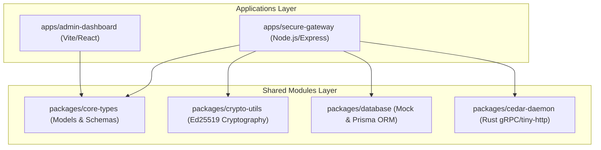

# ⚖️ FidusGate Architecture & Component Manual

FidusGate is an enterprise-grade, zero-trust repository governance and runtime verification platform specifically engineered for **Autonomous AI-Agent Operations**. It shifts security left, enforcing real-time programmatic access controls, deterministic signature verification, and automated static security analysis on agentic workflows.

This document serves as the comprehensive engineering guide detailing what each component is, how it runs, its security value, and its architectural function in the FidusGate monorepo.

---

## 📐 High-Level Monorepo Topology

FidusGate is structured as a modular **npm Workspaces** monorepo managed by **Turborepo** for high-efficiency build caching and parallelized task execution. 



---

## 📦 Monorepo Component Directory

| Component Name | Workspace Path | Package Identifier | Purpose & Value |
| :--- | :--- | :--- | :--- |
| **Secure Gateway Backend** | `apps/secure-gateway` | `@veritas/secure-gateway` | The security gatekeeper that intercepts tool calls, evaluates Cedar policies, and signs transaction receipts. |
| **Operations Dashboard** | `apps/admin-dashboard` | `@veritas/admin-dashboard` | The interactive administrative console for monitoring evaluations, auditing logs, and simulating policies. |
| **Rust Cedar Policy Daemon** | `packages/cedar-daemon` | `@veritas/cedar-daemon` | High-speed, Rust-native daemon executing schema-guided Cedar authorization decisions in a secure container. |
| **Cryptographic Utilities** | `packages/crypto-utils` | `@veritas/crypto-utils` | Encapsulates Ed25519 signature flows, offline CLI verifiers, and interfaces to remote HSM providers (Vault/GCP). |
| **Core Database Client** | `packages/database` | `@veritas/database` | Thread-safe transaction persistence layer supporting JSON local files and PostgreSQL database configurations. |
| **Unified Core Types** | `packages/core-types` | `@veritas/core-types` | Strictly typed interfaces for logs, receipts, compliance findings, and transaction payloads. |
| **Isolated Execution Sandbox** | `scripts/*` & `scripts/sandbox` | *N/A* | Shell-based runtime controllers providing copy-on-write Docker microVM mounts and gVisor isolation gates. |

---

## 🏛️ Component Profiles

---

### 🛡️ 1. Secure Gateway Backend (`apps/secure-gateway`)

#### 🔹 Value & Function
The **Secure Gateway Backend** is the high-security core of FidusGate. It acts as the intermediary proxy through which all autonomous agent operations (such as command execution, file writes, and ledger transactions) must flow.
* **Access Control Gatekeeping:** Evaluates incoming actions against the active Cedar policy file using both a local TypeScript fallback verifier and a high-speed Rust-native gRPC daemon.
* **PII Redaction Engine:** Intercepts outgoing data packages and utilizes regex-based masking to redact sensitive data (e.g., credit card numbers, JWT tokens, private keys) before storage.
* **Operational Webhooks:** Dispatches incident alerts to Slack and Microsoft Teams whenever high-risk actions are blocked or CI/CD static security issues are found.

#### 🔹 Operational Runbook
* **Development Mode:** Runs concurrently within the monorepo root using `npm run dev`. It defaults to port `3001` and hot-reloads on source modifications via `tsx`.
* **Production Mode:** Deployed as a Dockerized container (`apps/secure-gateway/Dockerfile`). In production, it relies on environment variables to mount:
  - `JWT_SECRET` for secure federated admin sessions.
  - `DATABASE_URL` for PostgreSQL storage integration.
  - `SLACK_WEBHOOK_URL` and `TEAMS_WEBHOOK_URL` for instant SecOps alerts.

---

### 🎨 2. Operations Dashboard (`apps/admin-dashboard`)

#### 🔹 Value & Function
The **Operations Dashboard** is a premium, space-obsidian glassmorphic administrative interface. It provides visual observability over the autonomous agent operations, giving security staff real-time insights and dry-run playgrounds.
* **Cryptographic Attestation Grid:** Displays real-time federated OIDC Oauth signatures, SPIFFE workload IDs, and active token budget states.
* **Forensic Auditing Timeline:** Lists all commands executed in sandboxes, displaying raw arguments, exit codes, and providing audit-ready JSON receipt downloads.
* **Interactive Policy Simulator:** Toggles a dry-run canvas allowing administrators to draft custom Cedar policies and instantly evaluate mock inputs without overwriting production rules.
* **Ledger Verifier:** Incorporates a client-side public-key cryptosystem verifying Ed25519 signature receipts, guaranteeing non-repudiation.

#### 🔹 Operational Runbook
* **Development Mode:** Runs on Vite at port `3000`. Starts via `npm run dev` and communicates with the Secure Gateway via Vite's proxy configurations.
* **Production Mode:** Compiles into highly optimized, static assets via `vite build` (outputs to `dist/`), which are then served via Nginx or a lightweight static file server inside a Docker container.

---

### 🦀 3. Rust Cedar Policy Daemon (`packages/cedar-daemon`)

#### 🔹 Value & Function
The **Rust Cedar Policy Daemon** provides the high-performance authorization backbone of the platform. Written in Rust, it interfaces directly with the official Google-backed `cedar-policy` crate, guaranteeing strict conformance to Cedar specifications.
* **Schema-Guided Validation:** Enforces strict types on entity contexts using `policy.cedarschema`. This prevents typological mismatch attacks, ensuring that arbitrary properties injected into evaluations do not bypass authorization boundaries.
* **In-Memory Decisioning:** Resolves complex authorization trees in microseconds, preventing pipeline lag for high-throughput AI agents.

#### 🔹 Operational Runbook
* **Compilation:** Managed via the package build task `npm run build --workspace=@veritas/cedar-daemon`, which triggers a multi-stage Docker build (`Dockerfile`) to compile the Rust binary in a release configuration.
* **Runtime:** Spawns as an independent microservice container on port `50051`. The secure gateway sends HTTP/REST authorization payloads to the daemon for evaluation, falling back gracefully to the TypeScript engine if the container is offline.

---

### 🔑 4. Cryptographic Utilities (`packages/crypto-utils`)

#### 🔹 Value & Function
The **Cryptographic Utilities** package provides the cryptographic engine for FidusGate, establishing a zero-trust model of non-repudiation.
* **Receipt Signature Blocks:** Signs audit logs using **Ed25519** public-key cryptography, embedding public keys, hashes of action payloads, and OIDC claims in a signed envelope.
* **HSM & KMS Providers:** Integrates transit signing pipelines pointing directly to **HashiCorp Vault Transit Engine** or **Google Cloud KMS AsymmetricSign** endpoints.
* **Verification CLI:** Exposes an offline command-line verifier allowing regulators to confirm receipt integrity without access to the FidusGate server.

#### 🔹 Operational Runbook
* **Library Import:** Imported as a local workspace dependency (`@veritas/crypto-utils`) by the secure-gateway.
* **CLI Execution:** Can be executed locally to generate keypairs or verify receipts:
  ```bash
  # Generate new Ed25519 keypair
  node packages/crypto-utils/dist/index.js --generate-keys
  
  # Verify a receipt JSON file
  node packages/crypto-utils/dist/index.js --verify receipt.json
  ```

---

### 💾 5. Core Database Client (`packages/database`)

#### 🔹 Value & Function
The **Core Database Client** manages transaction persistence across local and cloud environments, allowing FidusGate to operate as a low-overhead developer sandbox or a heavy-duty enterprise cluster.
* **Dual-Engine Design:** Detects the environment and operates in a zero-dependency, local file store mode (`command-logs.json`) for local development, or a full relational schema model using the **Prisma ORM** for production.
* **Seeded Security Assertions:** Automatically seeds mock compliance records, cryptographic SME roles, and sandbox operations logs on initialization to guarantee instant diagnostic capability.

#### 🔹 Operational Runbook
* **File Store Mode:** Defaults to reading/writing to `.memory/` directory local files.
* **Database Mode (PostgreSQL):** Activated by defining a `DATABASE_URL` in your environment. Run `npx prisma db push` to generate and apply the structured schema.

---

### 📝 6. Unified Core Types (`packages/core-types`)

#### 🔹 Value & Function
The **Unified Core Types** package defines the strictly typed structural boundaries of the monorepo.
* **Data Consistency:** Establishes shared TypeScript interfaces for transaction payloads (`Transaction`), cryptographic receipts (`AuditReceipt`), forensic logs, and compliance findings.
* **Contract Security:** Ensures that developers cannot alter telemetry shapes in the frontend or database without satisfying compiler requirements across all packages.

#### 🔹 Operational Runbook
* **Compilation:** Compiled using `tsc` to distribute JS outputs and ambient declarations (`.d.ts`).
* **Importing:** Included at the absolute top of the package dependency tree, imported globally via `@veritas/core-types`.

---

### 🐳 7. Isolated Execution Sandbox (`scripts/*`)

#### 🔹 Value & Function
The **Execution Sandbox** manages runtime virtualization, guaranteeing that high-risk terminal commands executed by autonomous agents cannot contaminate the host environment.
* **gVisor microVM Hardening (`setup-gvisor.sh`):** Configures Docker runtimes to use the `runsc` secure container sandboxing engine on Linux.
* **Ephemeral Overlay Mounts (`sandbox-execute.sh`):** Mounts the primary codebase as read-only (`ro`) and overlays a copy-on-write memory volume inside the execution container, discarding temporary modifications after calculating the final patch file.
* **Local CI/CD Emulation (`ci-verify.sh`):** Leverages `act` to boot unprivileged workflows, verifying security gates entirely offline inside local Docker networks.

#### 🔹 Operational Runbook
* **Execution:** Spawns transparently whenever the dashboard console executes a command or sandbox playbook:
  ```bash
  # Execute an arbitrary shell script inside the secure sandbox
  bash scripts/sandbox-execute.sh "npm run test" "/Users/sagehart/Documents/project"
  ```

---

## 💎 Premium Feature Architectures & Observability Flows

FidusGate implements four core premium modules designed for advanced enterprise governance:

### 1. Live + Draft Cedar Policy Simulator
* **Architecture:** Exposes a secure endpoint `/api/policy/simulate`. When active, it parses the input JSON structure `{ principal, action, context }`.
* **Dry-Run Isolation:** Toggling in-memory drafts runs the request against a temporary, sandboxed AST instantiation inside `cedar-evaluator.ts`. It reads matching policy IDs and maps them to clean user-facing comments in-memory, returning diagnostic matches without touching `policy.cedar` on the host filesystem.

### 2. Forensic JSON Exporter
* **Tamper-Evident Receipts:** Integrates securely with `/api/logs/compliance/:logId/export`.
* **Packaging Strategy:** Resolves log histories, matches them to OIDC OAuth attestation scopes (`GET /api/auth/attested-claims`), compiles Ed25519 signature strings, and bundles the resulting telemetry into a structured JSON envelope download. Gated exclusively to `admin` and `auditor` roles.

### 3. AI-Agent Auto-Remediation Suggestions
* **System Design:** Command-line inputs are parsed via `command-auditor.ts` using advanced tokenizer regular expressions.
* **Correction Loops:** If blocked execution patterns are detected, the gateway returns a custom recommendation structure within the JSON payload. Autonomous coding agents scan this field to self-correct command invocations.

### 4. Interactive Collapsible Portals Guide
* **UX Redesign:** Positioned as an inline collapsible accordion panel in `App.tsx` directly above the terminal shell window.
* **Animations & Styles:** Uses custom `@keyframes archSlideDown` and transition rules in `App.css` to open/close dynamically under a single React state trigger (`showArchPanel`), providing instant visibility of system runbooks to SecOps auditors.

---

*Manual maintained and verified by the Antigravity Security Engineering Team.*
