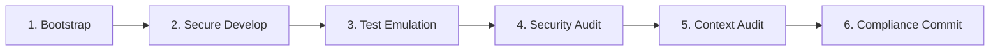

# DevOps Compliance Playbook

## Overview

A guide for governing and enforcing secure, high-standard DevOps practices on Antigravity development projects. This playbook teaches how to maintain toolchain consistency, use unprivileged sandbox execution, run continuous pipeline verification, perform workflow security scans, check for context drift, and perform zero-trust stateful releases.

These practices are statefully enforced by the **FidusGate Security Gateway** (the agent harness). If an agent attempts high-risk actions (like code commits or publishing) without completing mandatory DevOps verification steps, the secure harness will programmatically block the action using Cedar authorization controls.

---

## The Secure DevOps Lifecycle

To ensure product quality and security, Antigravity agents follow a strict, statefully gated linear engineering lifecycle:



1. **Bootstrap & Toolchain Consistency:** Standardize and verify project toolchains.
2. **Safe Development:** Modify code files in isolated, unprivileged sandboxes.
3. **Continuous Test Emulation:** Run local pipeline checks on every single code change.
4. **Static Security Auditing:** Scan workflow configuration files for latent vulnerabilities.
5. **Context Drift Auditing:** Keep local CLAUDE.md memory map fresh and in sync.
6. **Zero-Trust Secure Commits:** Commit verified changes and log cryptographic audit records.

---

## Step-by-Step Compliance Guide

### Step 1: Bootstrap & Toolchain Verification
Before working on the codebase, verify that your environment tools and runtime versions are locked down:
- Validate that the project has a valid `mise.toml` configuration.
- Run the environment bootstrapping script to set up local git hooks:
  ```bash
  bash scripts/bootstrap.sh
  ```
- Verify that your active runtimes (Node, Python, etc.) match the exact versions pinned in `mise.toml`.

### Step 2: Isolated Safe Development
To mitigate runaway local execution risks, all modifications and tests MUST be executed inside an unprivileged Docker sandbox container:
- Do not run raw scripts directly on the host shell.
- Run commands inside the secure sandbox using the execution script:
  ```bash
  bash scripts/sandbox-execute.sh "<command>" "<absolute_path_to_mount_dir>"
  ```
- Files outside of the specified source directories (like `apps/*`, `packages/*`, and `.memory/*`) are protected. Do not attempt to write directly to policy configurations (`policy.cedar`, `protect-mcp.config.json`) or bootstrap scripts (`scripts/*`) unless explicitly pre-authorized.

### Step 3: Continuous Test Emulation
The security gateway tracks whether the workspace is currently "Test Verified." 
- As soon as you modify any code files (via `write_file`, `replace_file_content`, etc.), the harness will transition the state to **Non-Compliant**, immediately blocking any code commits.
- To release this compliance block, you must run local CI/CD pipeline emulations:
  ```bash
  # Execute pipeline verification using the act runner helper
  bash scripts/ci-verify.sh
  ```
- If the pipeline succeeds, the gateway transitions the state to **Compliant** and releases the commit gate. If tests or linters fail, the state remains **Non-Compliant**.

### Step 4: Static Security Auditing
Scan CI/CD pipelines and GitHub workflows for potential security vulnerabilities (e.g. prompt injection, unsafe checkouts):
- Run the static security auditor:
  ```bash
  # Run the agentic action audit script
  node scripts/workflow-scanner.js
  ```
- Push findings to the gateway repository database (`POST /api/findings`).
- The security gateway will block commits if there are any outstanding **High** severity findings. You must remediate all High findings before the commit gate is released.

### Step 5: Context Drift Auditing
Keep your scoped `CLAUDE.md` sheets fresh to ensure that context does not drift as you add features:
- Run the HAM drift watcher script to verify that scoped files are up to date:
  ```bash
  bash scripts/ham-drift-watcher.sh
  ```
- Ensure the context drift count is `0`.

### Step 6: Zero-Trust Secure Commits
Once all compliance conditions (Pipeline, Security, HAM Drift) have been statefully verified by the gateway, execute the commit within the sandbox:
- Commit the changes securely:
  ```bash
  bash scripts/sandbox-execute.sh "git commit -m '<commit_message>'" "."
  ```
- Whenever a high-risk tool call is authorized, append a cryptographic writeback entry to `.memory/audit-log.md`:
  ```markdown
  ### [AUDIT] - <DATE> - <TIME>
  - **Tool Name:** <tool_name>
  - **Risk Tier:** <tier>
  - **Permission decision:** <allow/deny>
  - **Cedar Policy Digest:** <policy_sha256>
  - **Signature Receipt Key:** <ed25519_kid>
  ```

---

## Best Practices

- ✅ **Do:** Run `bash scripts/ci-verify.sh` immediately after any file edit to keep the workspace verified.
- ✅ **Do:** Remediate High-severity workflow findings immediately by removing untrusted dynamic prompt interpolation.
- ✅ **Do:** Verify that `.memory/audit-log.md` is appended cleanly.
- ❌ **Don't:** Attempt to perform raw git commit commands outside the sandbox or without running the tests first.
- ❌ **Don't:** Bypass the compliance gate by setting `DISABLE_DEVOPS_GATE=true` in production environments.

---

## Loop Protection & Circuit Breakers (Tier 2 Governance)

- **Loop Limit:** If a runtime installation, environment path configuration, `mise` command, or local pipeline test fails consecutively **3 times** during setup or verification, the agent MUST immediately cease execution loops.
- **Action:** Document the exact terminal outputs/logs, stop executing test loops, and escalate immediately to the human developer for manual intervention to prevent runaway CPU lockups and token burn.

---

## Related Skills

- `@protect-mcp-governance` — Access control policies and Ed25519 signed receipts.
- `@agentic-actions-auditor` — Static security scanning for GitHub Actions workflows.
- `@mise-configurator` — Standardizing development runtimes and configurations.
